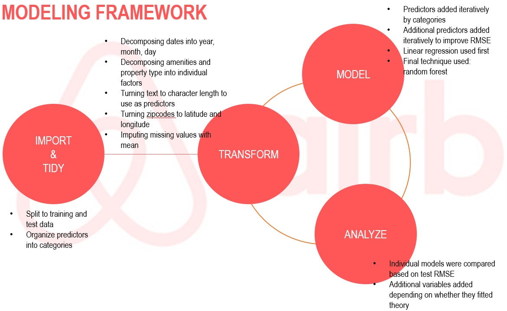

# Predicting Airbnb Rental Prices
by Charlie Mei

This project was part of an InClass Kaggle Competition for a course at Columbia University during Fall 2019.

This project was completed in R.

## 1 Introduction

This report outlines the process undertaken to predict Airbnb rentals prices in New York. This project was based on a dataset consisting of 90 features related to the property, the host and reviews of over 35,000 rental properties. The goal was to develop a supervised machine learning model that resulted in the lowest root mean squared error (RMSE) on a previously unseen dataset of Airbnb rentals.

## 2 Project workflow

A first pass at tackling this project resulted in a number of complications:

- Using one script file for all code was cumbersome for code review, editing and debugging.
- Not commenting code meant that understanding code written on previous days was time consuming and sometimes undecipherable.
- Blindly testing models and not recording which features were used in each model run resulted in confusion as to what methods had already been tested.

To address these complications, a consistent project workflow was developed to complete this project. The workflow consisted of:

1. using separate script files for different coding purposes. Code was written in two separate files - one file for reading and cleaning data, the other file for data modeling.
2. organizing script files into sections, separated by comments. The first script file was called *A_CLEANING*. All packages used were placed at the top of the script. Data were then imported before cleaning. The second script file was called *B_MODELING*. Here, the workspace was first cleared before the cleaned data were loaded again to be used for modeling.
3. having a modeling framework to guide model tuning and development, as described below.

## 3 Modeling framework

The modeling framework used in this project is illustrated in Figure 1 overleaf. 

The framework consists of four components: reading and tidying data, data transformation, modeling, and inference. Data were imported into R and tidied so that it was appropriate for modeling. Then, the cyclical and iterative process of data transformation, modeling, inference and analysis proceeded to find the optimal model that resulted in the lowest RMSE.

The first two components were scripted in the *A_CLEANING* file. The latter components were scripted in the *B_MODELING* file.

The processes undertaken in each of the four components are discussed below.

### Reading and tidying data

Data were read into R before being split into a training and test set using the **caret** package. Seventy per cent of the data were allocated to the training dataset.

The features in the dataset were broken into five categories:

1. features about the host
2. features about the location of the rental property
3. features about the property itself
4. features about reviews on the property
5. other miscellaneous features.

In terms of tidying data, all missing values in the features were imputed using the mean. An alternative could have been to use the **mice** package to implement a more rigorous imputation strategy. However, without a thorough understanding of the imputation method used in **mice**, it was decided to proceed with the simpler method that was more easily interpretible.

In cases where there were only a small amount of missing values, the missing observations were dropped from analysis to avoid introducing bias from imputation. For example, the beds variable only had three missing observations and these three observations were removed from all further analysis.

### Data transformation

Feature engineering was used to create meaningful additional features from text data in the original dataset. For each of the five categories, this involved the following:

* Features about the host: host since was turned into a date format and number of days from 1 January 2019, boolean values for verified host and superhosts were turned to factors.
* Features about location: zipcodes were turned to latitude and longitudes using the **zipcode** package
* Features about the property: amenities, property type, and cleaning fees, were broken down to individual factors on whether or not a property had the specific quality
* Features about reviews: first and last review days were turned to dates and number of days from 1 January 2019. The difference between first and last review days was also used as an indicator of how recently the property was reviewed.

Additional text analysis could have been useful to extract even more useful features for modeling. For example, constructing word clouds could provide additional information relating to what words were most commonly used in property descriptions, which can be used as predictors of prices.

Each of these features were added iteratively into the model, as described below.

### Modeling

Initially, linear regression was used to correlate Airbnb rental prices with property features. Features were initially added by category; features about the host were first run, followed by adding in features about location, and so on. When running linear models, only non-feature engineered variables were used.

The process of iteratively including additional features by category resulted in a test RMSE capping around 70 before increasing again when adding additional features. The decision was then made to switch to a random forest model using three-fold cross validation to improve prediction accuracy. Doing so was at the cost of model interpretability. However, given the objective of this project was to generate predictions with the lowest RMSE, this compromise was deemed appropriate.

Additional feature-engineered variables were then added to the random forest model. The process of adding features into the random forest model is described in below.

### Inference

After each model run, the test RMSE was calculated and compared with the proceeding model run. If the RMSE improved, then the additional features included were kept in the final model. If the RMSE increased, the model was first tuned by changing tuning the following parameters:

* the number of bootstraps used (ntree)
* the number of predictors used in each random forest (mtry)
* the number folds used for cross validation.

If tuning these parameters also resulted in a worsening of the RMSE, then these additional features were dropped and a different set of features were considered.

The final random forest model consisted of:

* 69 predictors
* 30 predictors used per tree
* three-fold cross validation
* 500 bootstraps (trees).

## 4 Final remarks

The main takeaway was that having a consistent project workflow greatly improved code readability, debugging and review throughout the project. By separating cleaning and modeling code into different files, it was easier to monitor, add and remove code to add additional features and test various models.

However, a number of improvements could potentially improve the RMSE score. Conducting a more thorough analysis of all text data, especially on those features related to the description of the property and the host, could have resulted in extracting more useful features to use for modeling. Additional knowledge of natural language processing techniques and methods could have been useful for constructing these additional features to improve RMSE.
